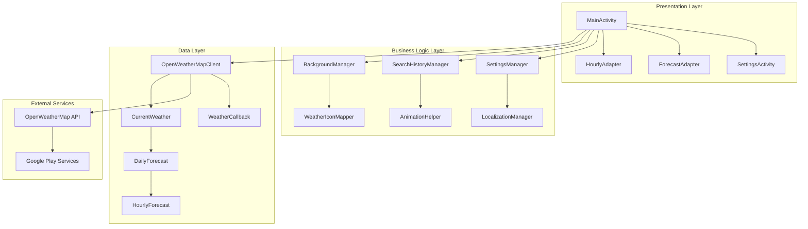
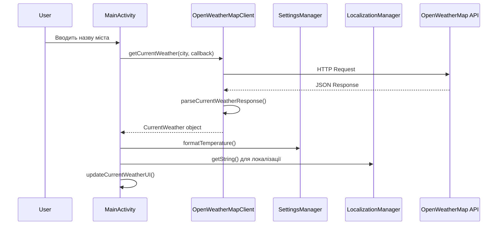
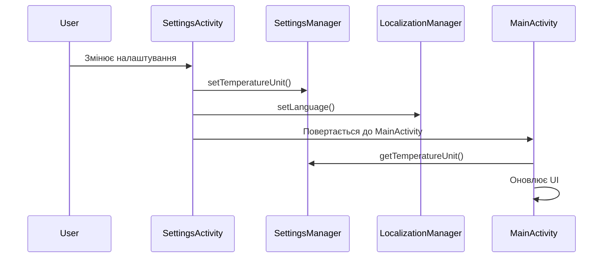
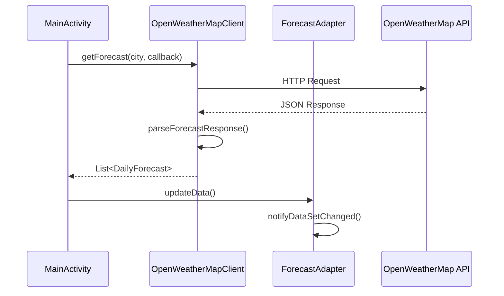

# 🏗️ Архітектура Aurora Weather

Цей документ описує архітектуру та дизайн-патерни, використані в проекті Aurora Weather.

## 📋 Зміст

- [Загальний огляд](#загальний-огляд)
- [Архітектурні принципи](#архітектурні-принципи)
- [Структура проекту](#структура-проекту)
- [Компоненти системи](#компоненти-системи)
- [Потоки даних](#потоки-даних)
- [Паттерни проектування](#паттерни-проектування)
- [Залежності](#залежності)
- [Масштабування](#масштабування)

## 🔍 Загальний огляд

Aurora Weather використовує **MVC (Model-View-Controller)** архітектуру з додатковими утилітарними класами для управління станом та бізнес-логікою.

### Архітектурна діаграма



## 🎯 Архітектурні принципи

### 1. **Separation of Concerns (Розділення відповідальностей)**
- **View**: UI компоненти та макети
- **Controller**: Activity та Fragment класи
- **Model**: Моделі даних та API клієнти
- **Utils**: Допоміжні класи та утиліти

### 2. **Single Responsibility Principle (Принцип єдиної відповідальності)**
- Кожен клас має одну чітко визначену відповідальність
- `SettingsManager` - тільки налаштування
- `LocalizationManager` - тільки локалізація
- `WeatherIconMapper` - тільки мапінг іконок

### 3. **Dependency Injection (Впровадження залежностей)**
- Використання Singleton pattern для менеджерів
- Передача Context через конструктори
- Callback pattern для асинхронних операцій

### 4. **Open/Closed Principle (Принцип відкритості/закритості)**
- Легко додавати нові типи погоди
- Легко додавати нові мови
- Легко додавати нові одиниці вимірювання

## 📁 Структура проекту

```
app/src/main/java/com/example/auroraweather/
├── MainActivity.java                 # Головний контролер
├── SettingsActivity.java             # Контролер налаштувань
├── SettingsManager.java              # Менеджер налаштувань
├── adapters/                         # Адаптери для списків
│   ├── ForecastAdapter.java          # Адаптер 5-денного прогнозу
│   └── HourlyAdapter.java            # Адаптер погодинного прогнозу
├── api/                              # API клієнти
│   ├── OpenWeatherMapClient.java     # Основний API клієнт
│   └── WeatherCallback.java          # Callback інтерфейс
├── models/                           # Моделі даних
│   ├── CurrentWeather.java           # Поточна погода
│   ├── DailyForecast.java            # Денний прогноз
│   └── HourlyForecast.java           # Погодинний прогноз
└── utils/                            # Утиліти та помічники
    ├── AnimationHelper.java          # Допоміжні анімації
    ├── BackgroundManager.java        # Управління фонами
    ├── LocalizationManager.java      # Система локалізації
    ├── SearchHistoryManager.java     # Історія пошуку
    └── WeatherIconMapper.java        # Мапінг іконок погоди
```

## 🧩 Компоненти системи

### 1. **Presentation Layer (Шар представлення)**

#### MainActivity
- **Відповідальність**: Головний UI контролер
- **Функції**:
  - Управління UI компонентами
  - Обробка користувацьких дій
  - Координація між різними компонентами
  - Управління життєвим циклом

#### SettingsActivity
- **Відповідальність**: UI для налаштувань
- **Функції**:
  - Відображення налаштувань
  - Обробка змін налаштувань
  - Збереження змін

#### Adapters
- **ForecastAdapter**: Відображення 5-денного прогнозу
- **HourlyAdapter**: Відображення погодинного прогнозу

### 2. **Business Logic Layer (Шар бізнес-логіки)**

#### SettingsManager
```java
public class SettingsManager {
    private static SettingsManager instance;
    private SharedPreferences prefs;
    
    // Singleton pattern
    public static SettingsManager getInstance(Context context) {
        if (instance == null) {
            instance = new SettingsManager(context);
        }
        return instance;
    }
    
    // Методи для роботи з налаштуваннями
    public int getTemperatureUnit() { ... }
    public void setTemperatureUnit(int unit) { ... }
    public String formatTemperature(double temp) { ... }
}
```

#### LocalizationManager
```java
public class LocalizationManager {
    private Map<String, String> translations;
    private String currentLanguage;
    
    // Завантаження перекладів з JSON
    private void loadTranslations(String languageCode) { ... }
    
    // Отримання локалізованого тексту
    public String getString(String key) { ... }
}
```

### 3. **Data Layer (Шар даних)**

#### OpenWeatherMapClient
```java
public class OpenWeatherMapClient {
    private RequestQueue requestQueue;
    private Context context;
    
    // Асинхронні методи для отримання даних
    public void getCurrentWeather(String city, WeatherCallback<CurrentWeather> callback) { ... }
    public void getForecast(String city, WeatherCallback<List<DailyForecast>> callback) { ... }
    public void getHourlyForecast(String city, WeatherCallback<List<HourlyForecast>> callback) { ... }
}
```

#### Models
```java
// Immutable data classes
public class CurrentWeather {
    private final String cityName;
    private final double temperature;
    private final String description;
    // ... інші поля
    
    // Constructor та getters
}
```

## 🔄 Потоки даних

### 1. **Завантаження поточної погоди**



### 2. **Зміна налаштувань**



### 3. **Завантаження прогнозу**



## 🎨 Паттерни проектування

### 1. **Singleton Pattern**
```java
public class SettingsManager {
    private static SettingsManager instance;
    
    public static SettingsManager getInstance(Context context) {
        if (instance == null) {
            instance = new SettingsManager(context);
        }
        return instance;
    }
}
```

### 2. **Observer Pattern (Callback)**
```java
public interface WeatherCallback<T> {
    void onSuccess(T data);
    void onError(String message);
}

// Використання
weatherClient.getCurrentWeather(city, new WeatherCallback<CurrentWeather>() {
    @Override
    public void onSuccess(CurrentWeather data) {
        updateUI(data);
    }
    
    @Override
    public void onError(String message) {
        showError(message);
    }
});
```

### 3. **Factory Pattern**
```java
public class WeatherIconMapper {
    public static String getAnimationForWeatherCode(int weatherCode) {
        if (weatherCode >= 200 && weatherCode < 300) {
            return "weather_thunder.json";
        } else if (weatherCode >= 300 && weatherCode < 400) {
            return "weather_drizzle.json";
        }
        // ... інші умови
    }
}
```

### 4. **Strategy Pattern**
```java
public class SettingsManager {
    public String formatTemperature(double tempCelsius) {
        int unit = getTemperatureUnit();
        switch (unit) {
            case TEMP_FAHRENHEIT:
                return celsiusToFahrenheit(tempCelsius) + "°F";
            case TEMP_KELVIN:
                return celsiusToKelvin(tempCelsius) + "K";
            default:
                return tempCelsius + "°C";
        }
    }
}
```

## 📦 Залежності

### Внутрішні залежності
- **MainActivity** → **SettingsManager**, **LocalizationManager**, **OpenWeatherMapClient**
- **SettingsActivity** → **SettingsManager**, **LocalizationManager**
- **ForecastAdapter** → **SettingsManager**, **LocalizationManager**, **WeatherIconMapper**
- **OpenWeatherMapClient** → **Models**, **WeatherCallback**

### Зовнішні залежності
- **Volley** → HTTP клієнт
- **Gson** → JSON парсинг
- **Lottie** → Анімації
- **Google Play Services** → Геолокація
- **Material Design** → UI компоненти

## 📈 Масштабування

### Поточні обмеження
- Всі дані зберігаються в пам'яті
- Немає офлайн кешування
- API ключ зберігається в коді

### Плани масштабування

#### 1. **Додати Repository Pattern**
```java
public interface WeatherRepository {
    void getCurrentWeather(String city, WeatherCallback<CurrentWeather> callback);
    void getForecast(String city, WeatherCallback<List<DailyForecast>> callback);
    void getHourlyForecast(String city, WeatherCallback<List<HourlyForecast>> callback);
}

public class WeatherRepositoryImpl implements WeatherRepository {
    private OpenWeatherMapClient apiClient;
    private WeatherCache cache;
    
    @Override
    public void getCurrentWeather(String city, WeatherCallback<CurrentWeather> callback) {
        // Перевірити кеш
        CurrentWeather cached = cache.getCurrentWeather(city);
        if (cached != null && !cache.isExpired(city)) {
            callback.onSuccess(cached);
            return;
        }
        
        // Завантажити з API
        apiClient.getCurrentWeather(city, new WeatherCallback<CurrentWeather>() {
            @Override
            public void onSuccess(CurrentWeather data) {
                cache.saveCurrentWeather(city, data);
                callback.onSuccess(data);
            }
            
            @Override
            public void onError(String message) {
                callback.onError(message);
            }
        });
    }
}
```

#### 2. **Додати Dependency Injection**
```java
public class WeatherModule {
    @Provides
    @Singleton
    public WeatherRepository provideWeatherRepository(OpenWeatherMapClient apiClient, WeatherCache cache) {
        return new WeatherRepositoryImpl(apiClient, cache);
    }
    
    @Provides
    @Singleton
    public SettingsManager provideSettingsManager(Context context) {
        return SettingsManager.getInstance(context);
    }
}
```

#### 3. **Додати MVVM архітектуру**
```java
public class WeatherViewModel extends ViewModel {
    private WeatherRepository repository;
    private MutableLiveData<CurrentWeather> currentWeather = new MutableLiveData<>();
    private MutableLiveData<String> error = new MutableLiveData<>();
    
    public void loadWeather(String city) {
        repository.getCurrentWeather(city, new WeatherCallback<CurrentWeather>() {
            @Override
            public void onSuccess(CurrentWeather data) {
                currentWeather.postValue(data);
            }
            
            @Override
            public void onError(String message) {
                error.postValue(message);
            }
        });
    }
}
```

## 🔧 Рекомендації для розвитку

### 1. **Покращення архітектури**
- Перехід на MVVM або MVP
- Додавання Repository pattern
- Використання Dependency Injection

### 2. **Покращення продуктивності**
- Додавання кешування
- Оптимізація RecyclerView
- Lazy loading для великих списків

### 3. **Покращення тестованості**
- Додавання Unit тестів
- Додавання UI тестів
- Mocking залежностей

### 4. **Покращення безпеки**
- Винесення API ключа в BuildConfig
- Obfuscation коду
- Валідація вхідних даних

---

Ця архітектура забезпечує хорошу основу для розвитку проекту, але може бути покращена з досвідом та зростанням проекту.
